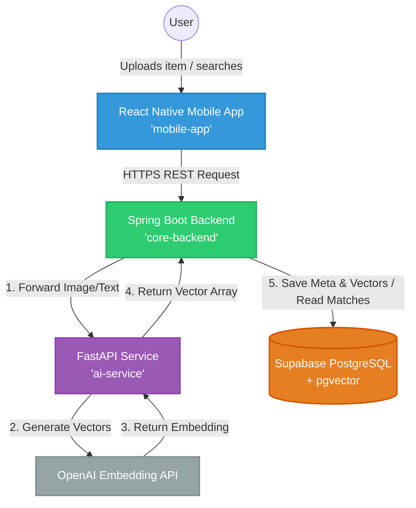

# FindIt

FindIt is an AI-powered lost-and-found platform that connects users with their missing items through intelligent image, description, location, and date-based matching.

## Project status

Currently under development for CS 160: Software Engineering at San José State University.

## Team 10 members

- Yug Amol More ([`Yug-More`](https://github.com/Yug-More))
- Marl Jonson ([`marlware`](https://github.com/marlware))
- Brody Smith ([`Brodys1`](https://github.com/Brodys1))

## Software architecture

- React Native (mobile interface: camera, GPS)
- Spring Boot (core enterprise logic: users, claims, security)
- FastAPI (small server for AI embeddings)
- Supabase (storage, auth)
- OpenAI API (vector embeddings)

### Diagram

# How to install

TODO:

- write prerequisites
- write instructions
- add design decisions to README
