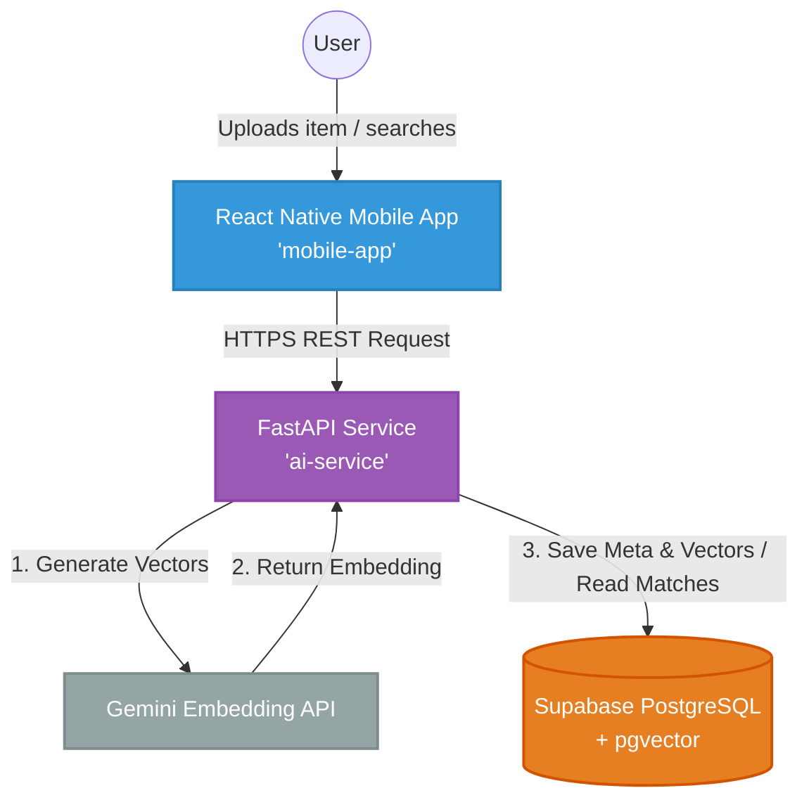

# FindIt

FindIt is an AI-powered lost-and-found platform that connects users with their missing items through intelligent image, description, location, and date-based matching.

## Project status

Currently under development for CS 160: Software Engineering at San José State University.

## Team 10 members

- Yug Amol More ([`Yug-More`](https://github.com/Yug-More))
- Marl Jonson ([`marlware`](https://github.com/marlware))
- Brody Smith ([`Brodys1`](https://github.com/Brodys1))

## Software architecture

- React Native (mobile interface: camera, GPS)
- FastAPI (single backend: users, claims, security, and AI embeddings)
- Supabase (storage, auth)
- Gemini API (vector embeddings)

### Diagram

```mermaid
graph TD
    %% Define Styles
    classDef client fill:#3498db,stroke:#2980b9,stroke-width:2px,color:#fff;
    classDef aiBackend fill:#9b59b6,stroke:#8e44ad,stroke-width:2px,color:#fff;
    classDef database fill:#e67e22,stroke:#d35400,stroke-width:2px,color:#fff;
    classDef external fill:#95a5a6,stroke:#7f8c8d,stroke-width:2px,color:#fff;

    %% Nodes
    User((User))
    MobileApp[React Native Mobile App<br/>'mobile-app']:::client
    AIService[FastAPI Service<br/>'ai-service']:::aiBackend
    SupabaseDB[(Supabase PostgreSQL<br/>+ pgvector)]:::database
    Gemini[Gemini Embedding API]:::external

    %% Data Flows
    User -->|Uploads item / searches| MobileApp
    MobileApp -->|HTTPS REST Request| AIService

    AIService -->|1. Generate Vectors| Gemini
    Gemini -->|2. Return Embedding| AIService

    AIService -->|3. Save Meta & Vectors / Read Matches| SupabaseDB
```

## How to install

> **Status:** preliminary. The backend (`ai-service`) and database schema are runnable. The Sprint 1 mobile app (`mobile-app`) runs locally against sample data. Live report submission is not connected yet, because `POST /items` requires a signed-in Supabase session.

### Prerequisites

- [Git](https://git-scm.com/)
- [Python 3.12+](https://www.python.org/downloads/) (needed for `ai-service`; avoid MSYS2/mingw Python builds, since they can't install some packages from PyPI)
- A [Supabase](https://supabase.com/) project (free tier) with the `vector` extension enabled
- A free [Gemini API key](https://aistudio.google.com/apikey) (used for embeddings)
- [Node.js](https://nodejs.org/) + npm (needed for `mobile-app`)

### Backend (`ai-service`)

1. Clone the repo and move into the backend:

   ```bash
   git clone https://github.com/Yug-More/find-it.git
   cd find-it/ai-service
   ```

2. Create a virtual environment and install dependencies:

   ```bash
   python -m venv .venv
   # Windows
   .venv\Scripts\activate
   # macOS/Linux
   source .venv/bin/activate

   pip install -r requirements.txt
   ```

3. Copy `.env.example` to `.env` and fill in your Supabase and Gemini credentials (see [`ai-service/README.md`](ai-service/README.md) for where to find each value).

4. Apply the database schema to your Supabase project: open the SQL editor and run [`database/schema.sql`](database/schema.sql).

5. Start the API:

   ```bash
   uvicorn app.main:app --reload
   ```

   It's now running at `http://localhost:8000`, with interactive docs at `http://localhost:8000/docs`.

See [`ai-service/README.md`](ai-service/README.md) for the full endpoint list and project structure.

### Database

Schema and seed instructions live in [`database/`](database/). Run [`schema.sql`](database/schema.sql) once per Supabase project; [`seeds.sql`](database/seeds.sql) has notes for adding local test data.

### Mobile app (`mobile-app`)

Sprint 1 includes the home screen, report form, reports list, and report details. The app uses sample data on the device by default. It does not submit reports to the API yet.

1. From the repository root:

   ```bash
   cd mobile-app
   npm install
   ```

2. Start Expo:

   ```bash
   npm start
   ```

   Open the project in Expo Go, a simulator, or the browser with `npm run web`.

3. Checks:

   ```bash
   npm test
   npm run lint
   npm run typecheck
   ```

Copy `.env.example` to `.env` only if you need to change the API URL or turn off sample data. See [`mobile-app/README.md`](mobile-app/README.md) for the screen list, environment variables, and the live API limitation.

Do not put access tokens in `.env`. Expo includes every `EXPO_PUBLIC_` variable in the client bundle.

### TODO

- add design decisions to README
